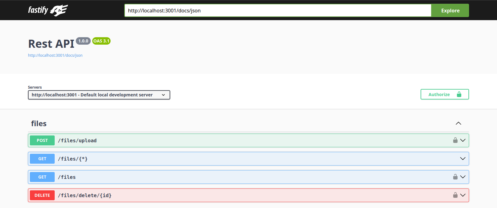
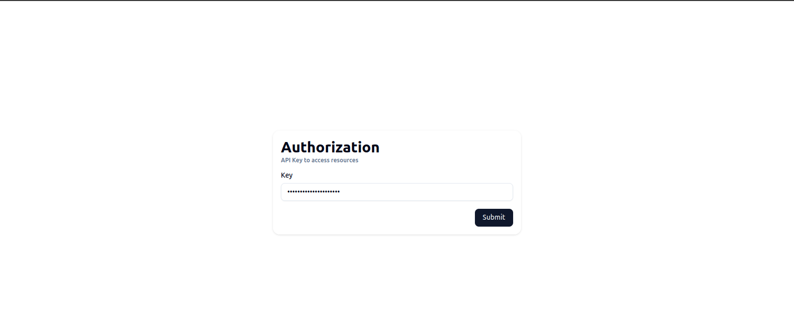
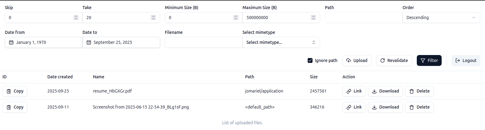

# Files Store Service

File management system API built with [fastify](https://fastify.dev/)

## Getting started

- [Backend setup](./backend/README.md)

## Scripts

| Script | Description              |
| ------ | ------------------------ |
| build  | build project            |
| start  | start (must build first) |

## Screenshots

- API endpoints
  

- Client side
  
  

## Extras

- [fastify template](https://github.com/jmrl23/fastify-template)
